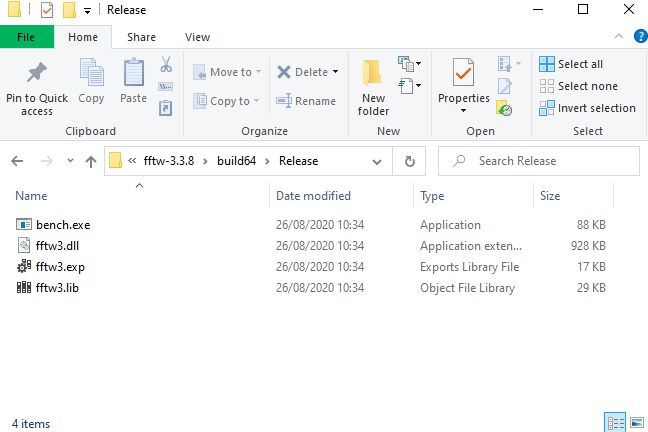

# Grid2Grid

## General Description

* A wrapper program for generating the nonlinear waves in flow solver.
* The nonlinear waves are pre-computed by Higher-Order Spectral (HOS) Method. 
* Developed by LHEEA, Ecole Centrale de Nantes(ECN).
* The following flow information can be retrieved:

     - Wave Elevation
     - Fluid Velocity
     - Dynamic Pressure

## How to Install?

### Third party libraries

* FFTW3
* HDF5

#### Install FFTW3 library

**Download source code** 

1. FFTW3 source code can be downloaded from http://www.fftw.org/download.html. 

**Unzip**

1. Unzip the folder in Windows

**Compilation**

<u>In Windows (PowerShell)</u>

1. Configure the CMake Project

   ```powershell
   cmake -G <GENERATOR_NAME> -A <OS_ENV> -B <BUILD_DIR_PATH> -S <CMAKE_PROJECT_DIR>
   ```

   * <GENERATOR_NAME> : Generator (For example “Visual Studio 14"”)
   * <OS_ENV>: Win32 or x64
   * <BUILD_DIR_PATH>: Directory to build (For example “build”)
   * <CMAKE_PROJECT_DIR>: CMake Project Directory (For example “.”)

2. Compile

   ```powershell
   cmake --build <BUILD_DIR_PATH> --target ALL_BUILD --config <BUILD_MODE>
   ```

   * BUILD_MODE: Release or Debug

   For example (In x64 Environment, Release mode)

   ```poweshell
   cmake -A x64 -B "build64" -S.
   cmake --build build64 --target ALL_BUILD --config Release
   ```

   Then, the compiled libraries can be found as: 

   

<u>In Linux (Shell, tested in Ubuntu 18.04.4 LTS)</u>

1. Configure the FFTW library

   ```shell
   ./configure --prefix=/DOWNLOAD_PATH
   ```

2. Compile the library

   ```shell
   make CFLAGS="-fPIC"
   make install
   ```

   Then, the library can be found in “lib/”

#### Install HDF5 library

It requires HDF5 third party library (version >= 1.8.16). You can:

* either download HDF5 library from
  https://support.hdfgroup.org/HDF5/

* or install package libhdf5-dev on Ubuntu 16.04.1

<u>In Windows (PowerShell)</u>

* On-going (We are sorry!)

<u>In Linux (Shell, tested in Ubuntu 18.04.4 LTS)</u>

1. Download HDF5 library (Cmake, Unix) and extract source code
   https://support.hdfgroup.org/HDF5/release/cmakebuild.html

2. Add following lines in a file "HDF5options.cmake"

   ```cmake
   #set(ADD_BUILD_OPTIONS "${ADD_BUILD_OPTIONS} -DHDF5_NO_PACKAGES:BOOL=ON")
       ### Create install package with external libraries (szip, zlib)
   
       set(ADD_BUILD_OPTIONS "${ADD_BUILD_OPTIONS} -DHDF5_PACKAGE_EXTLIBS:BOOL=ON")
       set(ADD_BUILD_OPTIONS "${ADD_BUILD_OPTIONS} -DHDF5_BUILD_FORTRAN:BOOL=ON")
       set(ADD_BUILD_OPTIONS "${ADD_BUILD_OPTIONS} -DBUILD_SHARED_LIBS:BOOL=ON")
       set(ADD_BUILD_OPTIONS "${ADD_BUILD_OPTIONS} -DHDF5_BUILD_CPP_LIB:BOOL=ON")
   ```

3. Compile with the following command

   ```shell
   ctest -S HDF5config.cmake,BUILD_GENERATOR=Unix -C Release -V -O hdf5.log
   ```

4. Check the library exists in a following path 

   ```shell
   ls build/bin/libhdf5.a build/bin/libhdf5_fortran.a build/bin/libszip.a build/bin/libz.a
   ```

5. Make soft link (Optional)

   ```shell
    ln -s ..../Cmake-hdf5-x /usr/local/lib/hdf5
   ```

6. Set HDF5_Library path in a "CMakeLists.txt" in Grid2Grid

   ```cmake
   set(HDF5_LIB_PATH /usr/local/lib/hdf5/build/bin)
   ```

## Install Grid2Grid

From version Grid2Grid version 2, CMake is used to compile the Grid2Grid library.

1. Set library dependency and paths for Grid2Grid (Grid2GridOptions.cmake)

   ```cmake
   ###... Fortran Compiler
   set(CMAKE_Fortran_COMPILER gfortran)
   
   ###... FFTW3 Library Path
   ### set(FFTW3_LIB_PATH  /home/yomy/Utility/fftw/fftw-3.3.8_GNU/lib)
   ### set(FFTW3_LIB_PATH  C:/Users/YOUNGCHOI/Choi/fftw-3.3.8/build64/Release)
   set(FFTW3_LIB_PATH  $FFTW3_LIB_PATH)
   
   ###... HDF5 Library Path
   ### set(HDF5_LIB_PATH  $HDF5_LIB_PATH)
   ### set(HDF_LIBRARY "ON")
   
   ###... Set Library Output path to be OpenFOAM Path
   ### set(BUILD_OF_LIB "ON")
   ```

   

2. Configure and Compile  Grid2Grid Project

   <u>In Windows (PowerShell)</u>, (For example: x64, Release Mode)

   ```powershell
   cmake -S. -Bbuild -A x64 
   cmake --build build --target ALL_BUILD --config Release
   ```

   <u>In Linux (Shell, tested in Ubuntu 18.04.4 LTS)</u>

   ```shell
   cmake -H. -Bbuild
   cmake --build build
   ```
